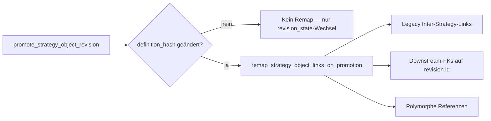
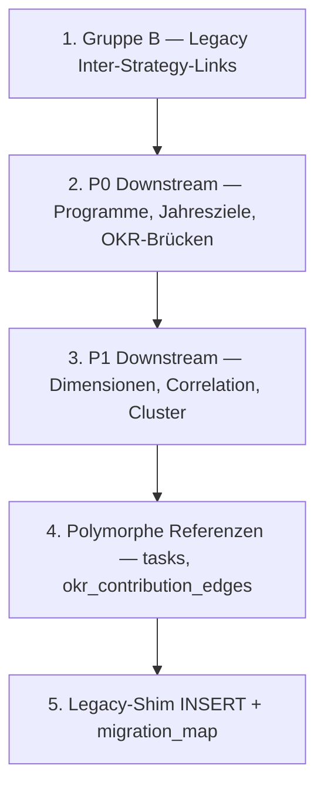

# Link-Remap-Matrix: Strategische Kernobjekte

**Status:** Phase-2b-Spezifikation (Voraussetzung für Phase 3)  
**Bezug:** Migration [`0152_strategy_object_identities_revisions.sql`](../supabase/migrations/0152_strategy_object_identities_revisions.sql), Plan *Strategy Object Versioning*

Dieses Dokument definiert, welche Verknüpfungen bei **`promote_strategy_object_revision`** aktualisiert werden müssen — und welche bewusst unverändert bleiben.

---

## 1. Grundlagen

### 1.1 ID-Semantik

| Konzept | Stabilität | Heutige FK-Nutzung |
|---------|------------|-------------------|
| `strategy_object_identities.id` | **stabil** über alle Revisionen und Zyklen (Carry) | Noch kaum in Downstream-FKs |
| `strategy_object_revisions.id` | **wechselt** bei jeder Promotion innerhalb eines `cycle_instance` | Entspricht heute `strategic_* .id` / `strategy_objectives.id` (Backfill: `revision.id = legacy.id`) |
| Legacy-Tabellen | Parallel-Write-Quelle bis Cutover | Alle bestehenden FKs zeigen hierauf |

**Backfill-Regel (0152):** Jede Legacy-Zeile hat `revision_number = 1` und `revision_state = current`; `revision.id` = Legacy-PK.

**Promotion-Regel (Phase 3):** Neue Revision erhält **neue UUID**; alte `current` → `superseded`. Identity bleibt gleich.

### 1.2 Wann ist Remap nötig?



Remap betrifft **nur Zeilen, die die alte `revision.id`** (bzw. das äquivalente Legacy-PK) als FK-Wert tragen. Identitäts-basierte Verknüpfungen sind von Definition her promotions-stabil.

### 1.3 Auslöser und Eingaben der Remap-RPC

Geplant für Phase 3:

```sql
remap_strategy_object_links_on_promotion(
  p_old_revision_id uuid,
  p_new_revision_id uuid,
  p_object_identity_id uuid,
  p_object_type text,
  p_cycle_instance_id uuid,
  p_organization_id uuid
) returns jsonb  -- Zähler pro Tabelle + Warnungen
```

**Aufruf:** transaktional aus `promote_strategy_object_revision`, **nach** `revision_state`-Wechsel, **vor** Legacy-Shim-Update.

**Lookup-Hilfe:** `strategy_object_migration_map` (legacy_id ↔ identity_id ↔ revision_id) und `object_identity_id` aus der Promotion.

**Bestehende Analogie:** Cycle-Carry in [`0083_strategy_review_procedure.sql`](../supabase/migrations/0083_strategy_review_procedure.sql) und [`0114_strategy_okr_objective_domain_split.sql`](../supabase/migrations/0114_strategy_okr_objective_domain_split.sql) — dort werden `challenge_map` / `direction_map` / `objective_map` gebaut und Links + Programme umgeschrieben. Die Promotion-Remap-RPC ist **innerhalb desselben `cycle_instance`** und betrifft typischerweise **nur eine** Identity (nicht den gesamten Zyklus).

---

## 2. Gruppe A — `strategy_object_relationships` (Identitäts-Graph)

**Implementierung 0152:** Relationships referenzieren **`source_object_identity_id`** und **`target_object_identity_id`** — nicht Revision-IDs.

| `relationship_type` | Quelle | Ziel | Legacy-Spiegel |
|---------------------|--------|------|----------------|
| `challenge_addresses_direction` | Challenge-Identity | Direction-Identity | `challenge_direction_links` |
| `direction_pursues_objective` | Direction-Identity | Objective-Identity | `strategic_direction_objective_links` |
| `objective_aligns_direction` | Objective-Identity | Direction-Identity | `objective_direction_links` |

### Remap bei Promotion (gleiche Identity)

| Aktion | Begründung |
|--------|------------|
| **Kein FK-Remap** | Identitäten ändern sich bei Revision-Promotion nicht |
| Optional: `metadata.last_promoted_revision_id` setzen | Nur Audit/Traceability, nicht funktional nötig |

### Remap bei „Replace“ (Challenge-Review-Sonderfall)

Wenn eine **neue Identity** entsteht (retire alt + neue Identity/Revision):

1. Alte Relationships → `lifecycle_state = retired`
2. Neue Relationships mit neuen Identity-IDs anlegen (gleiche `relationship_type`, neues `metadata.legacy_*` optional)
3. Legacy-Link-Tabellen separat (Gruppe B)

---

## 3. Gruppe B — Legacy Inter-Strategy-Links (revision.id-abhängig)

Diese Tabellen speichern FKs auf Legacy-PKs (= bisherige `revision.id`). Bei Promotion der betroffenen Seite: **UPDATE** der FK-Spalte von `p_old_revision_id` → `p_new_revision_id`.

| Tabelle | Spalte | Betroffen wenn promoted | Aktion | Unique-Constraint beachten |
|---------|--------|-------------------------|--------|----------------------------|
| `challenge_direction_links` | `strategic_challenge_id` | `strategic_challenge` | UPDATE | `(cycle_instance_id, strategic_challenge_id, strategic_direction_id)` |
| `challenge_direction_links` | `strategic_direction_id` | `strategic_direction` | UPDATE | gleich |
| `strategic_direction_objective_links` | `strategic_direction_id` | `strategic_direction` | UPDATE | `(cycle_instance_id, strategic_direction_id, strategy_objective_id)` |
| `strategic_direction_objective_links` | `strategy_objective_id` | `strategic_objective` | UPDATE | gleich |
| `objective_direction_links` | `strategy_objective_id` | `strategic_objective` | UPDATE | `(cycle_instance_id, strategy_objective_id, strategic_direction_id)` |
| `objective_direction_links` | `strategic_direction_id` | `strategic_direction` | UPDATE | gleich |

**Scope-Filter:** `cycle_instance_id = p_cycle_instance_id` und `organization_id = p_organization_id`.

**Konflikt-Strategie:** Wenn UPDATE gegen Unique-Constraint verstößt (selten: doppelte Kante nach Remap), Promotion **abbrechen** mit Fehler `link_remap_conflict` — kein stilles Merge.

**Dual-Write (Übergangsphase):** Nach Legacy-UPDATE `strategy_object_relationships` prüfen — bei Identity-Graph sollte keine Änderung nötig sein; bei Abweichung Audit-Log.

---

## 4. Gruppe C — Downstream-FKs (Ausführung & Planung)

Ausführungsobjekte (OKR, Jahresziele, Initiativen, Tasks) werden **nicht versioniert**. Nur FK-Werte, die auf eine **promoted `revision.id`** zeigen, werden umgeschrieben.

Legende **Priorität:**

| Prio | Bedeutung |
|------|-----------|
| **P0** | Muss in Phase-3-RPC — Kern-Alignment |
| **P1** | Phase 3, kann im selben Release folgen |
| **P2** | Optional / historisch / UI-only |
| **—** | Bewusst kein Remap |

### 4.1 Betroffen von `strategic_challenge`-Promotion

| Tabelle | Spalte | Prio | Aktion | Anmerkung |
|---------|--------|------|--------|-----------|
| `challenge_direction_links` | `strategic_challenge_id` | P0 | UPDATE | siehe Gruppe B |
| `strategy_programs` | `strategic_challenge_id` | P0 | UPDATE | nullable |
| `strategy_correlation_status_overrides` | `challenge_id` | P1 | UPDATE | Spaltenname ≠ `strategic_challenge_id` |
| `strategic_challenge_industries` | `strategic_challenge_id` | P1 | UPDATE | Dimensions-Join |
| `strategic_challenge_business_models` | `strategic_challenge_id` | P1 | UPDATE | Dimensions-Join |
| `strategic_challenge_analysis_entries` | `strategic_challenge_id` | P1 | UPDATE | Evidence-Links |
| `dashboard_column_config` | `challenge_id` | P2 | UPDATE | Matrix-UI-Konfiguration |
| `strategy_design_assist_feedback` | `challenge_id` | — | SKIP | Kein FK; historisches Feedback |
| `strategic_challenges` | `source_analysis_entry_id` | — | SKIP | Zeigt auf Analyse, nicht auf Challenge-Revision |

### 4.2 Betroffen von `strategic_direction`-Promotion

| Tabelle | Spalte | Prio | Aktion | Anmerkung |
|---------|--------|------|--------|-----------|
| `challenge_direction_links` | `strategic_direction_id` | P0 | UPDATE | Gruppe B |
| `strategic_direction_objective_links` | `strategic_direction_id` | P0 | UPDATE | Gruppe B |
| `objective_direction_links` | `strategic_direction_id` | P0 | UPDATE | Gruppe B |
| `annual_targets` | `strategic_direction_id` | P0 | UPDATE | Jahresziel-Alignment |
| `strategy_programs` | `strategic_direction_id` | P0 | UPDATE | nullable |
| `okr_objectives` | `leading_strategic_direction_id` | P0 | UPDATE | nullable; [`0150`](../supabase/migrations/0150_okr_objectives_leading_strategic_direction.sql) |
| `strategic_direction_cluster_links` | `strategic_direction_id` | P1 | UPDATE | |
| `strategic_direction_gap_links` | `strategic_direction_id` | P1 | UPDATE | indirekt auch `cluster_objective_relations` |
| `strategic_direction_industries` | `strategic_direction_id` | P1 | UPDATE | |
| `strategic_direction_business_models` | `strategic_direction_id` | P1 | UPDATE | |
| `strategic_direction_operating_models` | `strategic_direction_id` | P1 | UPDATE | |
| `direction_metric_links` | `strategic_direction_id` | P1 | UPDATE | |
| `strategy_correlation_status_overrides` | `strategic_direction_id` | P1 | UPDATE | |
| `dashboard_row_config` | `direction_id` | P2 | UPDATE | Matrix-UI |
| `strategy_design_assist_feedback` | `strategic_direction_id` | — | SKIP | Kein FK |

### 4.3 Betroffen von `strategic_objective`-Promotion

| Tabelle | Spalte | Prio | Aktion | Anmerkung |
|---------|--------|------|--------|-----------|
| `strategic_direction_objective_links` | `strategy_objective_id` | P0 | UPDATE | Gruppe B |
| `objective_direction_links` | `strategy_objective_id` | P0 | UPDATE | Gruppe B |
| `okr_objective_strategy_objectives` | `strategy_objective_id` | P0 | UPDATE | OKR-Brücke |
| `objective_target_links` | `strategy_objective_id` | P0 | UPDATE | Jahresziel-Traceability |
| `cluster_objective_relations` | `strategy_objective_id` | P1 | UPDATE | Gap/Cluster-Kontext |
| `strategy_correlation_status_overrides` | `strategy_objective_id` | P1 | UPDATE | |
| `objective_industries` | `strategy_objective_id` | P1 | UPDATE | |
| `objective_business_models` | `strategy_objective_id` | P1 | UPDATE | |
| `objective_operating_models` | `strategy_objective_id` | P1 | UPDATE | |
| `strategy_programs` | `supported_objective_ids` | P0 | ARRAY_REMAP | `uuid[]` — Helper wie `_remap_uuid_array_from_map` aus 0083 |
| `strategy_objectives` | `strategy_carry_source_id` | — | SKIP | Lineage zur Vorgänger-Revision; bewusst historisch |
| `strategy_design_assist_feedback` | `strategy_objective_id` | — | SKIP | Kein FK |

---

## 5. Gruppe D — Polymorphe und indirekte Referenzen

| Tabelle | Spalten | Match-Bedingung | Prio | Aktion |
|---------|---------|-----------------|------|--------|
| `tasks` | `source_object_type`, `source_object_id` | `source_object_type = 'strategic_direction'` und `source_object_id = p_old_revision_id` | P1 | UPDATE `source_object_id` |
| `tasks` | `source_object_type`, `source_object_id` | `source_object_type = 'strategy_objective'` und `source_object_id = p_old_revision_id` | P1 | UPDATE `source_object_id` |
| `strategy_review_feedback_entries` | `subject_type`, `subject_id` | `subject_type in ('challenge','focus_area','objective')` — Mapping auf `object_type` | P2 | UPDATE `subject_id` wenn Review noch offen; abgeschlossene Reviews optional SKIP |
| `okr_contribution_edges` | `target_type`, `target_id` | `target_type = 'strategy_objective'` | P1 | UPDATE `target_id` |

**Indirekt (kein direkter Remap):**

| Pfad | Verhalten |
|------|-----------|
| `initiatives` → `strategy_programs` | Programme werden via Gruppe C remapped; Initiativen folgen über `program_id` |
| `initiative_target_links` → `annual_targets` | Jahresziele folgen über `strategic_direction_id`-Remap |
| `annual_target_okr_alignments` | Folgt OKR-/Jahresziel-Remap |

---

## 6. Gruppe E — Explizit ausgeschlossen

Diese Objekte/Konzepte werden **nicht** im Remap berücksichtigt:

| Bereich | Grund |
|---------|-------|
| `okr_objectives`, `key_results` | Ausführungsobjekte — nur Brücken-FKs (Gruppe C) |
| `annual_targets` (außer `strategic_direction_id`) | Jahresziel-Entität selbst nicht versioniert |
| `initiatives`, `tasks` (außer polymorphe Source) | Ausführung |
| Assessments (`strategy_object_review_assessments`) | Zeigen auf `assessed_revision_id` — historisch korrekt auf alte Revision |
| `strategy_object_migration_map` | Append-only Audit; neue Zeile für neue `revision_id` bei Promotion |
| Abgeschlossene Strategy-Review-Snapshots | `pre_read_payload` / materialisierte Entscheidungen sind Punkt-in-Zeit |

---

## 7. Legacy-Shim bei Promotion (Phase 3, parallel zu Remap)

Bis Cutover schreibt die App noch in Legacy-Tabellen. Nach Promotion:

1. **Neue Legacy-Zeile** mit `id = p_new_revision_id` aus promoted Revision-Feldern (INSERT) **oder** UPDATE-In-Place nur wenn Legacy-Modell das weiterhin als „eine Zeile pro Identity“ führt → **Entscheidung Phase 3: INSERT neue Zeile + alte Zeile als historisch markieren** (empfohlen, konsistent mit `superseded`).
2. `strategy_object_migration_map`: neuer Eintrag `(legacy_table, legacy_id = p_new_revision_id, …)` — alter Eintrag bleibt.
3. Remap (Gruppen B–D) aktualisiert alle FKs auf `p_new_revision_id`.

**Wichtig:** Solange Legacy parallel läuft, muss Remap **sowohl** neue als auch bestehende Lesepfade konsistent halten.

---

## 8. Remap-Matrix nach `object_type` (Kurzreferenz)

| object_type | P0-Tabellen (UPDATE) | P1 | Skip |
|-------------|----------------------|-----|------|
| `strategic_challenge` | `challenge_direction_links.strategic_challenge_id`, `strategy_programs.strategic_challenge_id` | `strategy_correlation_status_overrides.challenge_id`, Dimension-Joins, `strategic_challenge_analysis_entries` | `source_analysis_entry_id`, Assist-Feedback |
| `strategic_direction` | Link-Tabellen (direction-Spalten), `annual_targets`, `strategy_programs`, `okr_objectives.leading_strategic_direction_id` | Dimension-Joins, `direction_metric_links`, `strategic_direction_*_links`, correlation overrides | Assist-Feedback |
| `strategic_objective` | Link-Tabellen (objective-Spalten), `okr_objective_strategy_objectives`, `objective_target_links`, `strategy_programs.supported_objective_ids` | `cluster_objective_relations`, Dimension-Joins, correlation overrides | `strategy_carry_source_id`, Assist-Feedback |

---

## 9. Implementierungsreihenfolge (Phase 3)



**Tests (Phase `phase-tests`):**

- Promotion Objective: `okr_objective_strategy_objectives` zeigt auf neue ID
- Promotion Direction: `annual_targets.strategic_direction_id` remapped
- Promotion Challenge: `challenge_direction_links` + `strategy_programs` remapped
- `supported_objective_ids`: Array-Remap via Map
- Unique-Constraint-Verletzung → Rollback
- Identity-Relationships unverändert nach Promotion

---

## 10. TypeScript-Bezugspunkte

Lesepfade, die nach Phase 3 weiterhin Legacy-IDs erwarten (bis Cutover auf operational views):

| Modul | Relevante Spalten |
|-------|-------------------|
| [`web/lib/strategy-cycle/queries.ts`](../web/lib/strategy-cycle/queries.ts) | Link-Tabellen, Programme, Challenges |
| [`web/lib/annual-targets/planning-data.ts`](../web/lib/annual-targets/planning-data.ts) | `strategic_direction_id` |
| [`web/lib/okr/planning-data.ts`](../web/lib/okr/planning-data.ts) | `strategy_objectives`, OKR-Brücken |
| [`web/lib/okr/leading-strategic-direction.ts`](../web/lib/okr/leading-strategic-direction.ts) | `leading_strategic_direction_id` |
| [`web/lib/strategy-cycle/correlation.ts`](../web/lib/strategy-cycle/correlation.ts) | `challenge_id` / `strategic_direction_id` / `strategy_objective_id` |
| [`web/lib/strategy-cycle/program-matrix.ts`](../web/lib/strategy-cycle/program-matrix.ts) | Programm-FKs |
| [`web/lib/traceability/queries.ts`](../web/lib/traceability/queries.ts) | Link- und Target-Tabellen |

Nach Einführung der RPCs: keine TS-Remap-Logik nötig — Remap ist **DB-transaktional**.

---

## 11. Abweichung Plan ↔ Implementierung 0152

| Plan-Entwurf | Tatsächlich 0152 | Konsequenz für Remap |
|--------------|------------------|----------------------|
| Relationships auf `source_revision_id` / `target_revision_id` | Relationships auf **Identity-IDs** | Promotion remapt Relationships **nicht** |
| `operational_signal` vs. `health_status` | `operational_signal` in Assessments | Kein Einfluss auf Link-Remap |

Diese Spezifikation folgt dem **implementierten** Schema.

---

## 12. Offene Entscheidungen für Phase 3

1. **Legacy-Zeile bei Promotion:** INSERT neue Zeile vs. UPDATE — Empfehlung: INSERT + historische Zeile behalten (oder `archived` Flag falls eingeführt).
2. **Review-Feedback (P2):** Remap nur für offene Reviews?
3. **Dashboard-Konfiguration (P2):** Remap oder Nutzer neu zuordnen lassen?

Diese Punkte blockieren nicht die P0-Implementierung der Remap-RPC.
